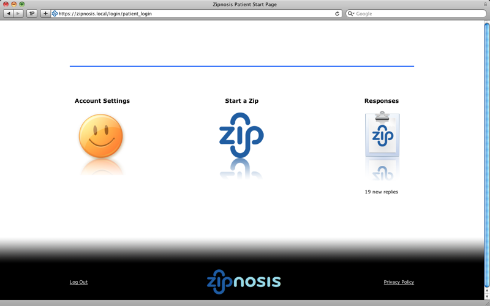
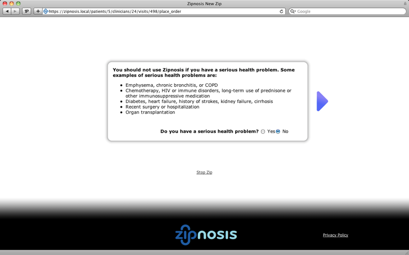
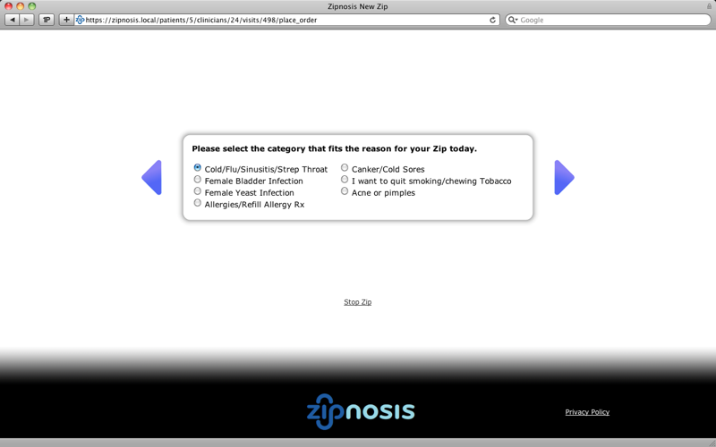
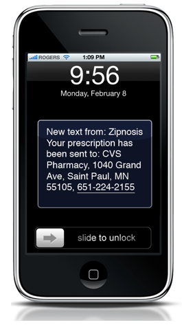
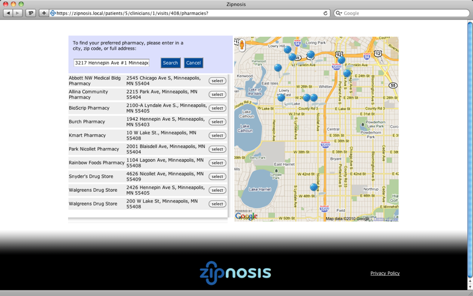

!SLIDE
# How it works #

!SLIDE center
## Patients start a Zip using a computer or smart phone. ##

!SLIDE center
## In 5-8 minutes, patient answers a series of questions. ##

!SLIDE center
## In 5-8 minutes, patient answers a series of questions. ##

!SLIDE bullets incremental
# Clinician reviews the zip #

* Summary of the patient's answers

* Ordered list of potential diagnoses

* Structured options for treatments and prescriptions (checkboxes, etc.)

* Response assembled into human-readable text

!SLIDE bullets incremental
# Typical responses to a zip #

* No prescription – just a cold.

* Prescription – just low-level antibiotics or topical treatment.

* Be seen in a clinic.

!SLIDE center
# Response in one hour or less #

!SLIDE center
## Patients can use Google Maps to send prescriptions to the most convenient pharmacy. ##

